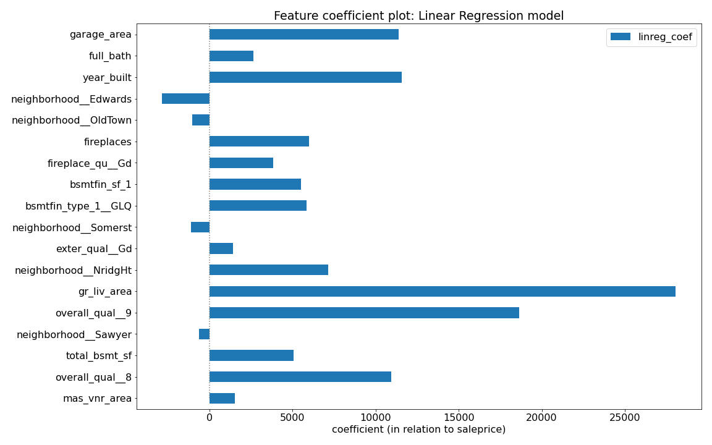

# Project 2 - Ames Housing Data and Kaggle Challenge

---

## Problem Statement

Build a regression model to predict housing sale prices in Ames, Iowa. This model should support prospective homeowners assess list price reasonableness within Ames, Iowa, and inform their purchase decision.

As a project pre-requisite, this requires creating and iteratively refining a regression model to address the Ames, Iowa data set from Kaggle. Kaggle submissions determine outcome quality based on root mean squared error (rsme).

## Executive Summary

From our analysis, the linear regression model (with StandardScaler) provides a reasonable regression model for ballpark housing list price estimates.

Coefficients with the largest predictive value in the model showed house size, quality, features and location were significant variables influencing housing prices in Ames, Iowa. While we visit only 18 features in this model, we are predicting ~80% of the sale price (CV score), and this is generally good enough as a ballpark figure.

As seen in the data set, there are many features, quantitative and qualitative, to examine within real estate. Ultimately, relating these factors to a seller's own evaluation of the property price as well as a buyer's propensity to purchase the asset is important.

Taking the buy-side view, location proximity to places of interest (or work) could be very important for a buyer that wants to lease out the home. A buyer who wants to purchase a home for personal stay may be more interested in living area and community features of the location. Past sales prices per house are also very natural and important starting points when buying houses; most would not buy a house that has an unreasonably inflated price tag.

Do note that the applicability of this model is restricted in many ways to the Ames, Iowa, area. We would not, for example, expect this model to work at all in Singapore, where it would be quite unrealistic to evaluate number of fireplaces a house has. Indeed, the neighborhoods variables used would not be applicable beyond this dataset.

Given more time, it could be interesting to engineer some features dealing with price per square foot on an assessable net living area. Understanding how the overall quality surveys were done as well as ranking neighborhood districts from different angles (e.g. community value to homeowners) may also be interesting data points worth collecting. Exploring some price indicies as a proxy for past sales prices may also be interesting (e.g. S&P/Case-Shiller U.S. National Homes Price Index).

---

## What was done

1. Explore data, visualize and interpret base features, then extract / engineer relevant features.

2. Models used include Linear Regression, Lasso, Ridge, ElasticNet, a DummyRegressor as baseline.

3. Transformations used include log(x+1) and StandardScaler.

4. Evaluate and choose production model based on Kaggle score performance.

5. Interpret model results.

---

## Conclusions and Further Research

Perhaps as one might have predicted independently of this analysis, house size, house quality, house features, and housing location do have a demonstrable impact on how much a house can go for on the market.

It is important to understand that there are many direct features of the house itself and it is often very difficult to judge human behavior in establishing a reasonable price. While we visit only 18 features in this model, we are predicting ~80% of the sale price, and this is generally good enough as a ballpark figure.

Beyond this, time-series information as well as past sales prices become increasingly relevant, as well as buyer profiles: for example, speculative / investment asset purchases would be very different in nature from purchases for personal stay.

Also, one should note that the applicability of this model is restricted in many ways to the Ames, Iowa, area. We would not, for example, expect this model to work at all in Singapore, where it would be quite unrealistic to evaluate number of fireplaces a house has.

Given more time, it could be interesting to engineer some features dealing with price per square foot on an assessable net living area. Understanding how the overall quality surveys may also be interesting.

#### More information
[Data description](http://jse.amstat.org/v19n3/decock/DataDocumentation.txt).

---

## Submission

Materials must be submitted by the beginning of class on **Friday, 7 Jan 2022**.

Your technical report will be hosted on Github. Make sure it includes:

- A README.md (that isn't this file)
- Jupyter notebook(s) with your analysis and models (renamed to describe your project)
- At least one successful prediction submission on [DSI-US-11 Regression Challenge](https://www.kaggle.com/c/dsi-us-11-project-2-regression-challenge) 
- Data files
- Presentation slides
- Any other necessary files (images, etc.)

---

## Presentation Structure

- **Must be within time limit established by local instructor.**
- Use Google Slides or some other visual aid (Keynote, Powerpoint, etc).
- Consider the audience. Assume you are presenting to a non-technical audience (real estate agents, property owners, etc.).
- Start with the **data science problem**.
- Use visuals that are appropriately scaled and interpretable.
- Talk about your procedure/methodology (high level).
- Talk about your primary findings.
- Make sure you provide **clear recommendations** that follow logically from your analyses and narrative and answer your data science problem.

Be sure to rehearse and time your presentation before class.

